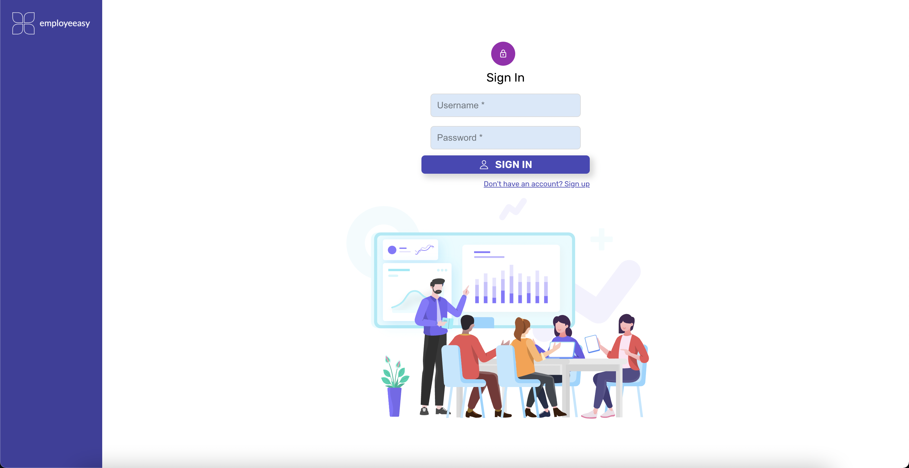
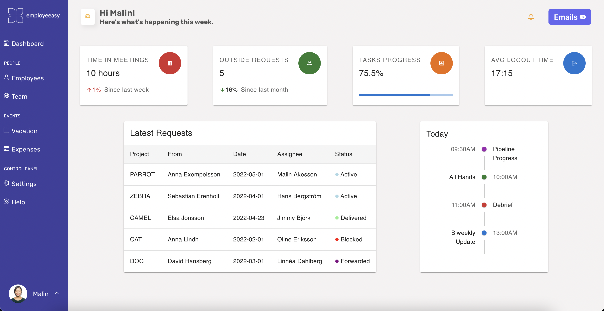

# Employeeasy

Employeeasy is a new web-app which streamlines managing of your employees, using a minimal UI that focuses on functionality and ease of use. Built with individual managers in mind, this app is a tool that lets you:

- Add your team to it
- View all your employees in one place
- Manage employees' vacation
- Manage team expenses and link them to the corresponding employee

Using the built-in dashboard, take a glance at your weekly overview, including your daily meetings and your average statistics.

## Demo

A demo version of the application, which you can try out, is deployed [here](https://employeeasy.netlify.com). You can login using the following credentials:

- username: _malinholmgren_
- password: _12345_

You are also free to create your own personal account. After signing up, use the same credentials to log into the environment. In that case, note that:

- you should probably not use personal information when signing up, for security reasons
- you will only be able to see employees in the database which are linked under other existing accounts

On successful login, the employeeasy server generates a web token with which authentication is performed. The token is saved in the browser's `localStorage()`, so if you close the tab, you will still be logged in. The token is set to expire after one hour and after that you have to re-log into the environment in order to be able to execute actions.

## Live Walkthrough

## Local Run

Clone this repo and run `npm i`. The app should work locally, since it points to a deployed version of the employeeasy server.

## Tech Stack

Employeeasy is written on React (using Redux and hooks for state management), HTML5 and CSS3.

## Screenshots

Below are some screenshots so you can get an idea of what the app looks like.

### Login Page

## 

### Dashboard

## 

### All Employees

## 

### Adding a new employee

## 

### Vacation

## 

### Help Center

## 
