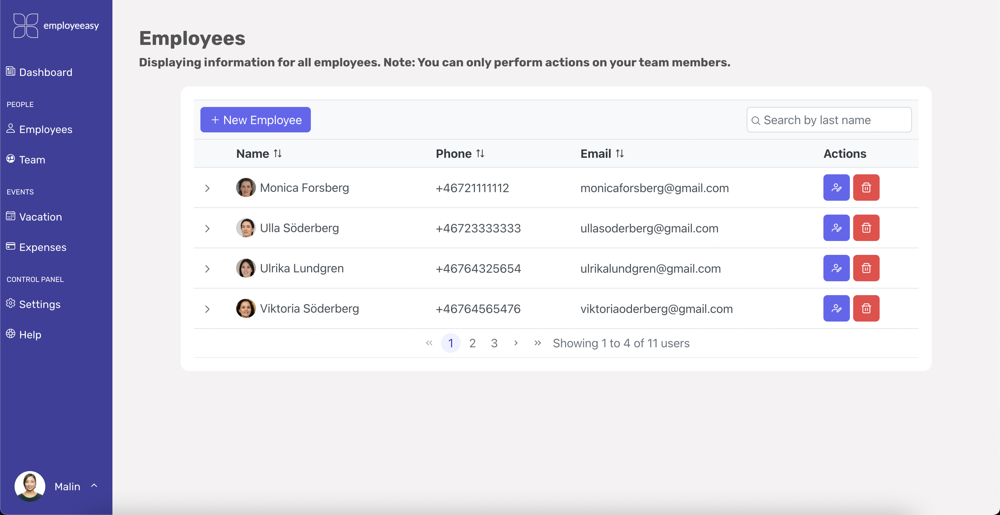
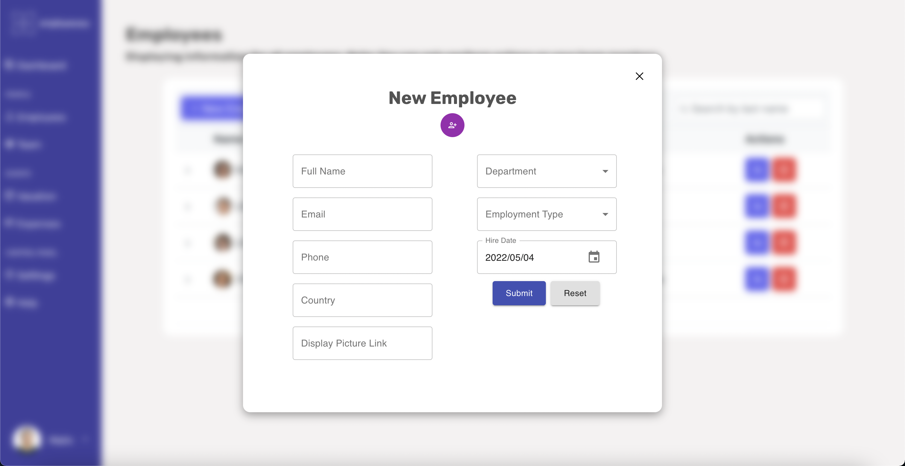

# Employeeasy

Employeeasy is a new web-app which streamlines managing of your employees, using a minimal UI that focuses on functionality and ease of use. Built with individual managers in mind, this app is a tool that lets you:

- Add your team to it
- View all your employees in one place
- Manage employees' vacation
- Manage team expenses and link them to the corresponding employee

Using the built-in dashboard, take a glance at your weekly overview, including your daily meetings and your average statistics.

## Live Walkthrough

## Local Run

Clone this repo and run `npm i`. The frontend will work, but for security reasons I have not included the credentials to connect to the MongoDB instance, so you will have to contact me and I will gladly work it out for you.

## Tech Stack

Employeeasy is written on React (using Redux for state management), JS, HTML5 and CSS3.

## Screenshots

Below are some screenshots so you can get an idea of what the app looks like.

### Login Page

## 

### Dashboard

## 

### All Employees

## 

### Adding a new employee

## 

### Vacation

## 

### Help Center

## 
